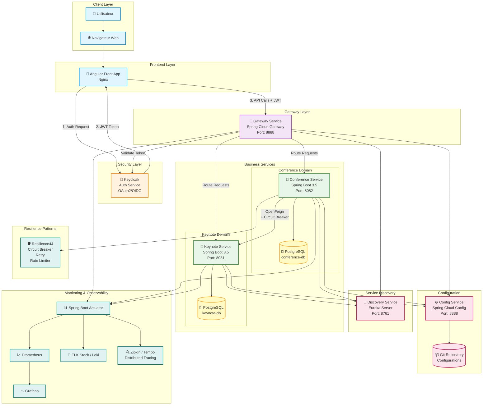

# Spécification Fonctionnelle - Application de Gestion des Conférences

## Architecture Technique

### Vision d'ensemble
- Architecture micro-services basée sur Spring Boot 3.5 et Spring Cloud 2025, segmentée en services métiers (`keynote-service`, `conference-service`) et services techniques (`gateway-service`, `discovery-service`, `config-service`).
- Chaque micro-service est packagé en conteneur Docker, exposé sur un réseau overlay Docker Compose et communiqué via HTTP/JSON.
- Les bases de données métier sont isolées : PostgreSQL (prod) ou H2 (dev) pour `keynote-service`, PostgreSQL/H2 pour `conference-service`. Les schémas sont gérés par Flyway.
- L'observabilité repose sur Spring Boot Actuator, un agrégateur de logs (ELK ou Grafana Loki) et des métriques Prometheus/Grafana.

### Flux applicatif principal
1. L'utilisateur accède à l'application Angular (`angular-front-app`) servie par Nginx ; il est redirigé vers Keycloak pour l'authentification OIDC.
2. Le jeton d'accès JWT est renvoyé côté front, stocké de manière sécurisée (HTTP-only cookie) et utilisé dans chaque requête vers la passerelle.
3. Le `gateway-service` (Spring Cloud Gateway) valide le jeton auprès de Keycloak, enrichit les en-têtes et route la requête vers le micro-service ciblé.
4. Le `discovery-service` (Eureka Server) référence dynamiquement les instances ; le gateway et les micro-services s'y enregistrent pour obtenir les adresses cibles.
5. Les micro-services récupèrent leur configuration externe au démarrage via le `config-service` (Spring Cloud Config) connecté à un dépôt Git chiffré.
6. `conference-service` consomme `keynote-service` via OpenFeign sécurisé, avec des circuit breakers Resilience4J et des fallbacks pour garantir la tolérance aux pannes.

### Architecture logique des micro-services
- **`keynote-service`** : couche web (Spring MVC + springdoc-openapi), service métier, couche DAO (Spring Data JPA), mapping DTO/Entity (MapStruct), base de données relationnelle dédiée.
- **`conference-service`** : structure identique, enrichie par un client Feign, la gestion des reviews, le calcul de score, et une couche d'intégration Resilience4J.
- Les deux services exposent une documentation Swagger UI (springdoc-openapi-starter) et des endpoints Actuator sécurisés.
- Les tests automatisés combinent tests unitaires (JUnit 5, Mockito) et tests d'intégration (Testcontainers pour PostgreSQL, WireMock pour Feign).

### Sécurité et gouvernance
- Keycloak gère les realms, clients confidentiels/publics, rôles (`ROLE_ADMIN`, `ROLE_USER`) et mappages d'attributs.
- Les micro-services utilisent Spring Security Resource Server (OAuth2) pour valider les JWT, avec propagation du contexte de sécurité via Feign et des règles RBAC par endpoint.
- Les secrets (mots de passe DB, clés JWT) sont externalisés dans Vault ou chiffrés dans Config Server (Spring Cloud Config + Spring Cloud Vault).

### Résilience, scalabilité et communication
- Resilience4J (circuit breaker, retry, rate limiter) protège les appels inter-services ; le fallback renvoie des données dégradées.
- Chaque conteneur est horizontalement scalable ; Eureka + Gateway assurent le load balancing round-robin.
- La communication interne est synchrones (REST). Pour des évolutions asynchrones, l'architecture prévoit l'ajout d'un broker (Apache Kafka) sans impacter les contrats existants.

### Infrastructure & déploiement
- Environnement local : Docker Compose orchestrant `config-service`, `discovery-service`, `gateway-service`, `keynote-service`, `conference-service`, `angular-front-app`, `keycloak`, `postgres-keynote`, `postgres-conference`.
- Environnement cible : Kubernetes (optionnel), avec Helm charts, ingress controller (Nginx), ConfigMaps/Secrets pour la configuration et Horizontal Pod Autoscaler.
- CI/CD : GitHub Actions ou Jenkins pour builder les artefacts Maven, lancer les tests (unitaires + SonarCloud), publier les images dans un registry et déployer via Compose/K8s.

### Gestion de la documentation et du monitoring
- OpenAPI 3.0 généré automatiquement, publié via Swagger UI (gateway fournit un endpoint agrégé).
- Logs centralisés, traçabilité distribuée via Spring Cloud Sleuth + Zipkin/Tempo.
- Tableaux de bord Grafana pour le suivi des temps de réponse, du taux d'erreur et de la santé des circuit breakers.

## Périmètres des Microservices

### Microservice Keynote
**Périmètre :** Gestion complète des intervenants (keynotes)
- Création, modification, suppression et consultation des keynotes
- Recherche des keynotes par critères (nom, fonction, etc.)
- Attribution de keynotes aux conférences
- Exposition d'API REST pour l'interopérabilité avec les autres services

**Responsabilités :**
- Maintenir l'intégrité des données des keynotes
- Fournir des endpoints pour la gestion des keynotes
- Communiquer avec le service de conférences via Open Feign

### Microservice Conference
**Périmètre :** Gestion complète des conférences et des reviews
- Création, modification, suppression et consultation des conférences
- Gestion des inscriptions aux conférences
- Gestion complète des reviews (ajout, modification, suppression)
- Calcul des scores moyens des conférences basé sur les reviews
- Communication avec le service Keynote pour obtenir les informations des intervenants

**Responsabilités :**
- Maintenir l'intégrité des données des conférences et des reviews
- Fournir des endpoints pour la gestion des conférences et des reviews
- Utiliser Open Feign pour communiquer avec le service Keynote
- Implémenter des circuit breakers avec Resilience4J

### Service Auth (Keycloak)
**Périmètre :** Gestion de l'authentification et de l'autorisation
- Authentification des utilisateurs (OAuth2/OIDC)
- Gestion des rôles et permissions
- Sécurisation des APIs des microservices
- Single Sign-On (SSO) pour l'application

**Responsabilités :**
- Fournir des tokens JWT pour l'authentification
- Gérer les sessions utilisateurs
- Configurer les clients et les realms
- Gérer les politiques d'accès

### Frontend (Angular)
**Périmètre :** Interface utilisateur de l'application
- Interfaces pour la gestion des keynotes
- Interfaces pour la gestion des conférences
- Système de notation et de reviews
- Tableaux de bord et statistiques
- Formulaires d'inscription aux conférences

**Responsabilités :**
- Fournir une expérience utilisateur intuitive
- Communiquer avec les microservices via la Gateway
- Gérer l'authentification et les sessions côté client
- Implémenter une interface responsive

## Schéma de Base de Données

### Base de Données Keynote-Service
**Entité: Keynote**
- `id` (Long) : Identifiant unique du keynote
- `nom` (String) : Nom de famille du keynote
- `prenom` (String) : Prénom du keynote
- `email` (String) : Adresse email du keynote
- `fonction` (String) : Fonction ou titre professionnel du keynote

### Base de Données Conference-Service
**Entité: Conference**
- `id` (Long) : Identifiant unique de la conférence
- `titre` (String) : Titre de la conférence
- `type` (Enum) : Type de conférence (ACADEMIQUE, COMMERCIALE)
- `date` (LocalDateTime) : Date et heure de la conférence
- `duree` (Integer) : Durée de la conférence en minutes
- `nombreInscrits` (Integer) : Nombre de personnes inscrites
- `score` (Double) : Score moyen de la conférence basé sur les reviews
- `keynoteId` (Long) : Référence à l'identifiant du keynote assigné (clé étrangère)

**Entité: Review**
- `id` (Long) : Identifiant unique de la review
- `date` (LocalDateTime) : Date de la review
- `texte` (String) : Contenu textuel de la review
- `note` (Integer) : Note attribuée (1 à 5 étoiles)
- `conferenceId` (Long) : Référence à la conférence concernée (clé étrangère)

**Relation: Conference - Review**
Une conférence peut avoir plusieurs reviews (relation One-to-Many)

**Relation: Keynote - Conference**
Un keynote peut être assigné à plusieurs conférences, et une conférence peut avoir un keynote assigné (relation Many-to-One)

## Services Techniques

### Gateway Service
- Basé sur Spring Cloud Gateway
- Point d'entrée unique pour toutes les requêtes
- Routage vers les microservices appropriés
- Intégration de la sécurité OAuth2/OIDC

### Discovery Service
- Basé sur Eureka Server ou Consul Discovery
- Enregistrement et découverte dynamique des services
- Equilibrage de charge

### Config Service
- Basé sur Spring Cloud Config ou Consul Config
- Configuration centralisée des microservices
- Gestion des propriétés par environnement

## Sécurité
- Authentification basée sur OAuth2 et OIDC avec Keycloak
- Protection des APIs des microservices
- Gestion des rôles (admin, utilisateur)
- Validation des tokens JWT

## Documentation
- Documentation des APIs REST avec OpenAPIDoc (Swagger)
- Documentation des endpoints disponibles pour chaque service

## Résilience
- Circuit breakers avec Resilience4J
- Gestion des timeouts et des retries
- Fallback pour les services indisponibles

## Déploiement
- Conteneurisation avec Docker
- Orchestration avec Docker Compose
- Configuration des dépendances entre services
- 

